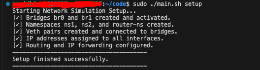
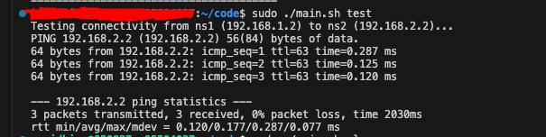
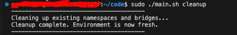

# Linux Network Namespace Simulation

## 1. Project Overview
This project simulates a networking environment with two isolated subnets connected through a virtual router using Linux Network Namespaces, Bridges, and Veth pairs.

## ✨ Key Features
- **Automated Setup:** Deploy the entire topology with a single command.
- **Namespace Isolation:** Demonstrated Layer 2 isolation using Linux network namespaces.
- **Routing Logic:** Configured `router-ns` for inter-subnet communication.
- **Cleanup Utility:** One-command removal of all virtual interfaces to keep the host system clean.

## 🛠 Prerequisites
Before running the script, ensure you have the following installed:
- Linux Kernel (Ubuntu/Debian recommended)
- `iproute2` package
- `bridge-utils` (optional but recommended)

## 2. Network Topology Diagram
```text
      [ ns1 ]                   [ ns2 ]
   192.168.1.2/24            192.168.2.2/24
         |                         |
      [ br0 ]                   [ br1 ]
         |                         |
    192.168.1.1               192.168.2.1
      [         router-ns         ]
           (IP Forwarding: ON)
```
## 3. IP Addressing Scheme

| Entity | Interface | IP Address | Gateway |
| :--- | :--- | :--- | :--- |
| **Namespace 1 (ns1)** | veth-ns1 | 192.168.1.2/24 | 192.168.1.1 |
| **Namespace 2 (ns2)** | veth-ns2 | 192.168.2.2/24 | 192.168.2.1 |
| **Router (router-ns)** | veth-r0 | 192.168.1.1/24 | N/A |
| **Router (router-ns)** | veth-r1 | 192.168.2.1/24 | N/A |

## 4. Configuration Details

* **Isolation:** Each namespace (**ns1**, **ns2**) belongs to a different subnet, ensuring isolation at **Layer 2**.
* **Bridges:** `br0` and `br1` act as virtual switches for their respective networks, providing the necessary link-layer connectivity.
* **Routing:** The `router-ns` acts as the central gateway. **IP Forwarding** is enabled within this namespace to allow seamless traffic flow between Subnet 1 and Subnet 2.

---

## 5. How to Run

Go to code directory 

Use the provided automation script (**main.sh**) to manage the entire simulation environment.

### 🚀 Setup the Environment
To create namespaces, bridges, and configure routing:
```bash
sudo ./main.sh setup
```

## 🧪 Verification Snapshot
Here is the successful setup environment:


### 🔍 Test Connectivity

To verify the communication between ns1 and ns2:

```bash
sudo ./main.sh test
```
## 🧪 Verification Snapshot
Here is the successful connectivity test:



### 🧹 Cleanup All Resources

To delete all namespaces and bridges and reset the environment:

```bash
sudo ./main.sh cleanup
```

## 🧪 Verification Snapshot
Here is the successful cleanup test:


## 6. Testing Results
The connectivity was successfully verified using the ping command from ns1 to ns2.

Result: ✅ 0% packet loss confirmed.

✅ End-to-end routing through router-ns is functional.
\
